# CI/CD Workflow - Regression Testing

## Overview

This document describes the automated continuous integration (CI) workflow that ensures code quality and prevents regressions before merging to the main branch.

## Workflow Diagram

```mermaid
graph TD
    A[Developer Creates PR] --> B[GitHub Actions Triggered]
    B --> C[Job 1: Lint & Type Check]
    B --> D[Job 2: Build]
    B --> E[Job 3: E2E Tests]
    
    C --> F{All Checks Pass?}
    D --> F
    E --> F
    
    F -->|Yes| G[✅ PR Ready to Merge]
    F -->|No| H[❌ PR Blocked - Fix Issues]
    
    H --> I[Developer Fixes Code]
    I --> J[Push New Commit]
    J --> B
    
    G --> K[Merge to Main]
    K --> L[Production Build]
    
    style G fill:#90EE90
    style H fill:#FFB6C1
    style E fill:#87CEEB
```



## Trigger Events

The CI workflow runs automatically on:

1. **Pull Requests** - Any PR to any branch
2. **Push to Main** - Direct pushes to main branch
3. **Push to Feature Branches** - Pushes to `feat/**` branches

```yaml
on:
  pull_request:
  push:
    branches: [ main, feat/** ]
```

## Pipeline Jobs

### 1️⃣ Lint and Type Check

**Purpose:** Catch code quality issues and type errors early

**Runs:**
- ESLint code linting
- TypeScript type checking (`tsc -b --noEmit`)

**Time:** ~30 seconds

**Fails When:**
- ESLint errors found
- TypeScript type errors detected
- Unused variables/imports (warnings promoted to errors)

**Example Failures:**
```typescript
// Type error
const age: number = "30"; // ❌ Type 'string' is not assignable to type 'number'

// Lint error
const unused = 5; // ❌ 'unused' is defined but never used
```

---

### 2️⃣ Build Application

**Purpose:** Verify the code can be built for production

**Depends On:** Lint and Type Check (must pass first)

**Runs:**
- TypeScript compilation
- Vite production build
- Asset optimization and bundling

**Time:** ~45 seconds

**Fails When:**
- Build errors occur
- Import errors detected
- Asset processing fails

**Artifacts:**
- Build artifacts uploaded for inspection
- Retained for 7 days

---

### 3️⃣ E2E Regression Tests ⭐

**Purpose:** Ensure all critical user flows work correctly

**Depends On:** Lint and Type Check (must pass first)

**Runs:**
- Installs Playwright and Chromium browser
- Starts dev server (`npm run dev`)
- Runs 31 E2E tests across 9 test suites
- Captures screenshots on failure

**Time:** ~45-60 seconds

**Expected Results:**
- ✅ 28 tests passing
- ⏭️ 5 tests skipped (require credentials or full onboarding)
- ❌ 0 tests failing

**Test Coverage:**
- App initialization and routing
- Welcome screen navigation
- Profile form validation (6 edge cases)
- Unit switching and persistence
- Authentication UI presence
- API key validation
- Dynamic experience/fitness descriptions
- Multi-tab state consistency
- Dev environment cache behavior

**Fails When:**
- Any runnable test fails
- Test timeouts occur
- Selectors can't find elements
- Assertions don't match expected values

**Artifacts on Failure:**
- Playwright HTML report
- Screenshots of failed tests
- Browser traces
- Retained for 7 days

---

## Status Checks

### Required Checks

To protect the main branch, configure these as **required status checks** in GitHub:

1. ✅ **Lint and Type Check**
2. ✅ **Build Application**
3. ✅ **E2E Regression Tests**

### Setting Up Branch Protection

**GitHub Repository Settings → Branches → Add Rule**

For `main` branch:
- ✅ Require a pull request before merging
- ✅ Require status checks to pass before merging
  - Select: `Lint and Type Check`
  - Select: `Build Application`
  - Select: `E2E Regression Tests`
- ✅ Require branches to be up to date before merging
- ✅ Do not allow bypassing the above settings
- ✅ Require linear history (optional but recommended)

---

## Developer Workflow

### Creating a PR

```bash
# 1. Create feature branch
git checkout -b feat/my-feature

# 2. Make changes and commit
git add .
git commit -m "feat: add new feature"

# 3. Push to GitHub
git push origin feat/my-feature

# 4. Create PR on GitHub
# CI workflow automatically runs
```

### PR Status

**All Checks Passing:**
```
✅ Lint and Type Check — passed
✅ Build Application — passed  
✅ E2E Regression Tests — passed (28 passed, 5 skipped)

🟢 All checks have passed
✅ This branch has no conflicts with the base branch
🔀 Merge pull request
```

**Some Checks Failing:**
```
❌ Lint and Type Check — failed
❌ Build Application — passed
✅ E2E Regression Tests — passed

🔴 Some checks were not successful
❌ Merging is blocked
```

### Fixing Failures

**View Details:**
1. Click on "Details" next to failed check
2. Review error logs
3. Download artifacts if available

**Common Fixes:**

**Lint Errors:**
```bash
npm run lint        # Check errors
npm run lint --fix  # Auto-fix some issues
```

**Type Errors:**
```bash
npm run typecheck   # Check types
# Fix type errors manually
```

**Build Errors:**
```bash
npm run build       # Reproduce locally
# Fix import/syntax errors
```

**E2E Test Failures:**
```bash
npm run test:e2e           # Run all tests
npm run test:e2e:ui        # Debug with UI
npx playwright test --debug e2e/04-profile-validation.spec.ts  # Debug specific test
```

---

## Running Checks Locally

Before pushing, run the same checks that CI will run:

```bash
# Full CI simulation
npm run lint && npm run typecheck && npm run build && npm run test:e2e

# Individual checks
npm run lint              # Lint check
npm run typecheck         # Type check
npm run build             # Production build
npm run test:e2e          # E2E tests
npm run test:e2e:ui       # E2E tests with UI
```

---

## Parallel Execution

Jobs run in parallel where possible for faster feedback:

```
┌─────────────────────────────────────┐
│  Lint and Type Check (30s)         │
└──────────┬──────────────────────────┘
           │
           ├──────────┬───────────────┐
           │          │               │
    ┌──────▼─────┐ ┌─▼──────────┐   │
    │   Build    │ │ E2E Tests  │   │
    │   (45s)    │ │   (60s)    │   │
    └────────────┘ └────────────┘   │
                                     │
    Total Time: ~90 seconds          │
    (vs. ~135s if sequential)        │
└─────────────────────────────────────┘
```

---

## Troubleshooting

### Tests Pass Locally But Fail in CI

**Possible Causes:**
1. **Environment differences**
   - Node version mismatch
   - Missing dependencies
   - Environment variables not set

2. **Timing issues**
   - Race conditions
   - Network timeouts
   - Async operations not awaited

3. **Browser differences**
   - CI uses headless Chromium
   - Local may use headed browser

**Solutions:**
- Check Node version matches CI (20.x)
- Ensure all dependencies in `package.json`
- Increase timeouts for slow operations
- Test with headless mode locally: `npx playwright test --headed=false`

### Tests Fail Intermittently

**Flaky Test Indicators:**
- Sometimes passes, sometimes fails
- Timing-dependent failures
- Random timeouts

**Solutions:**
- Increase `waitForTimeout` in tests
- Use `waitForLoadState('networkidle')`
- Add explicit waits for dynamic content
- Use `waitForSelector` before interacting with elements

### CI Takes Too Long

**Current Time:** ~90 seconds total

**If optimization needed:**
- Cache `node_modules` (already enabled)
- Run only changed test suites
- Use test sharding for parallel execution
- Skip browser installation for lint/build jobs

---

## Monitoring and Alerts

### GitHub Checks

View all check runs:
1. Go to PR
2. Click "Checks" tab
3. View detailed logs for each job

### Email Notifications

Configure in GitHub Settings:
- **Settings → Notifications → Actions**
- Get emails when:
  - Workflow fails
  - Workflow succeeds after previous failure

---

## Best Practices

### ✅ Do's

- ✅ Run tests locally before pushing
- ✅ Fix CI failures immediately
- ✅ Keep PRs small and focused
- ✅ Write tests for new features
- ✅ Update tests when changing behavior
- ✅ Review CI logs when debugging
- ✅ Keep CI fast (under 2 minutes)

### ❌ Don'ts

- ❌ Force push to bypass checks
- ❌ Merge with failing tests
- ❌ Skip flaky tests without fixing
- ❌ Commit `console.log()` debugging
- ❌ Ignore TypeScript errors with `@ts-ignore`
- ❌ Push directly to main
- ❌ Disable required status checks

---

## Metrics and Reporting

### Test Results

View historical test results:
- **Actions → CI → Select run**
- Download `playwright-report` artifact for HTML report
- View screenshots in `test-results` artifact

### CI Success Rate

Track over time:
- % of PRs passing first time
- Average time to fix failures
- Most common failure types

**Goal:** 95%+ first-time pass rate

---

## Future Enhancements

### Potential Additions

1. **Visual Regression Testing**
   - Screenshot comparison
   - Detect unintended UI changes

2. **Performance Testing**
   - Lighthouse CI
   - Bundle size checks
   - Core Web Vitals monitoring

3. **Security Scanning**
   - Dependency vulnerability checks
   - Secret scanning
   - SAST (Static Application Security Testing)

4. **Code Coverage**
   - Track test coverage percentage
   - Enforce minimum coverage thresholds
   - Upload to Codecov/Coveralls

5. **Deployment Preview**
   - Deploy PR to preview URL
   - Automatic cleanup after merge

---

## Related Documentation

- [TESTING.md](../TESTING.md) - Testing guide and commands
- [TEST_RESULTS_FINAL.md](../TEST_RESULTS_FINAL.md) - Current test results
- [.github/workflows/README.md](../.github/workflows/README.md) - Workflow documentation
- [e2e/README.md](../e2e/README.md) - E2E test specification

---

## Support

**Questions or Issues?**
- Check existing GitHub Issues
- Review failed check logs
- Consult documentation above
- Ask in team chat/Slack

**Emergency Bypass?**
- Contact repository admin
- Document reason in PR
- Create follow-up issue to fix properly
