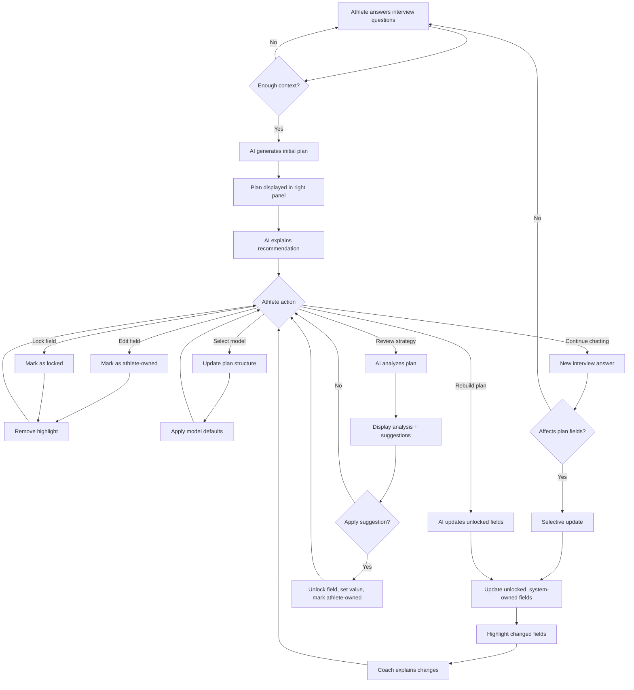
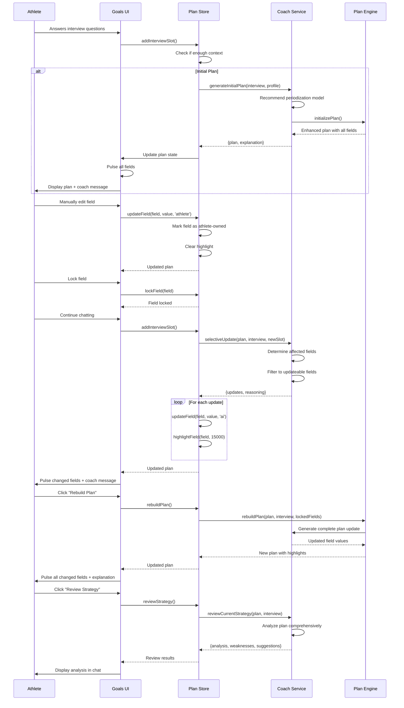
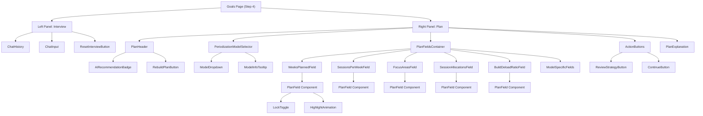
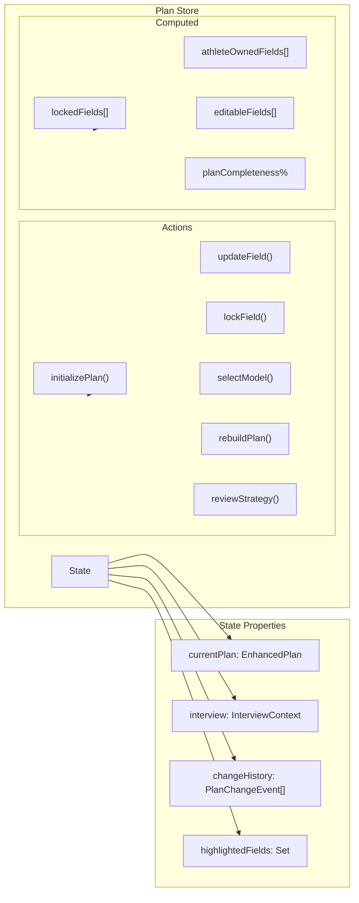
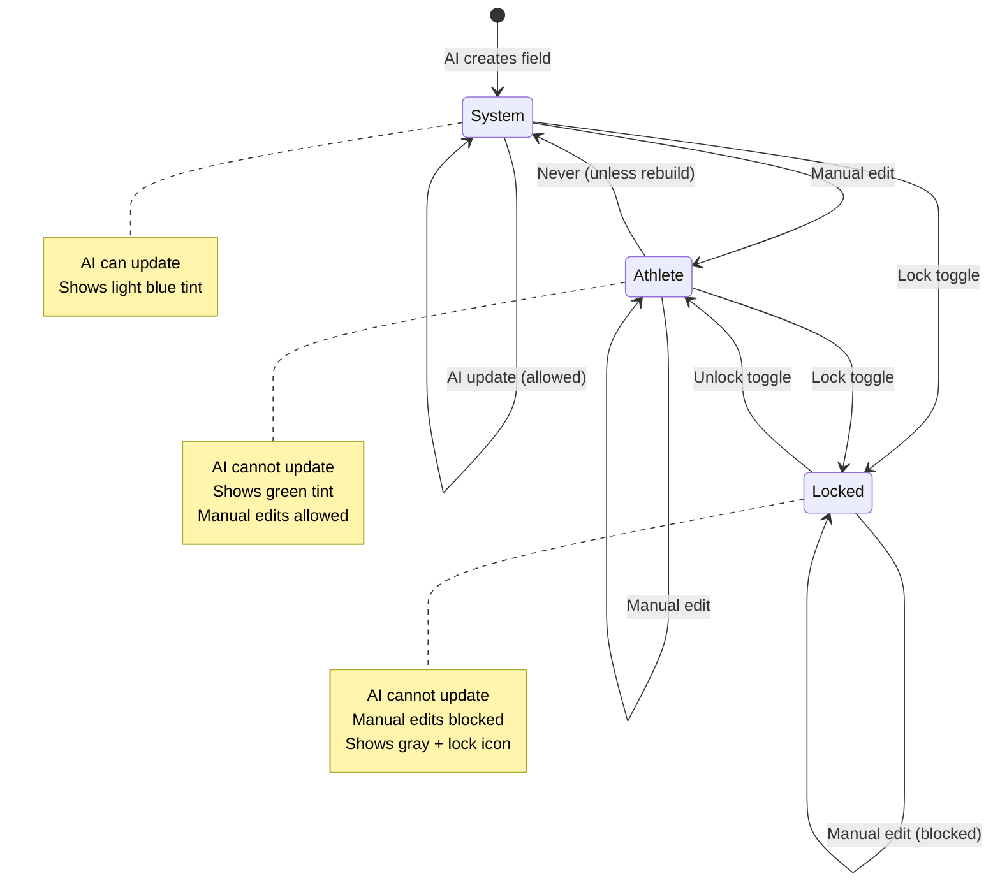
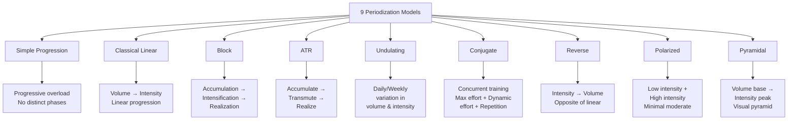
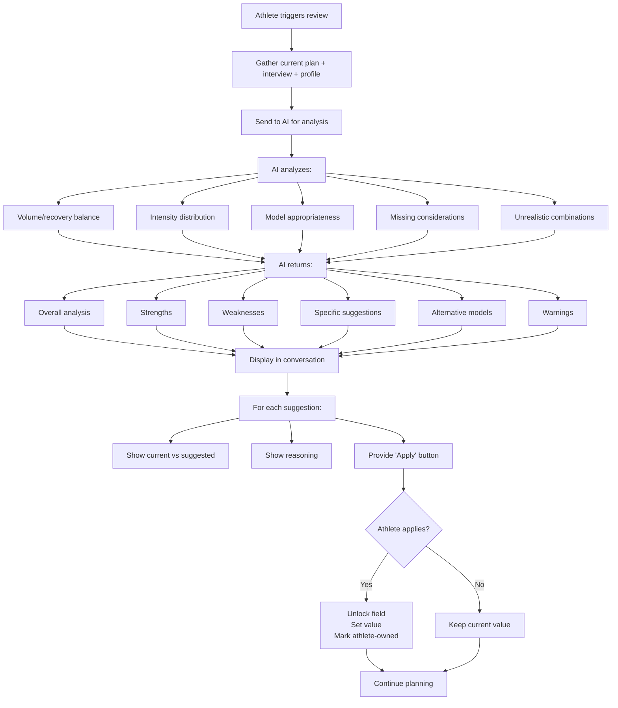

# Mesocycle System Architecture

## System Flow Diagram

## Data Flow

## Component Hierarchy

## State Management Architecture

## Field Ownership State Machine

## Periodization Models Overview

## Review Strategy Flow

## Critical Interaction Patterns

### Pattern 1: Initial Recommendation
1. Athlete answers questions → accumulates in InterviewContext
2. System checks if `shouldTriggerInitialPlan()` = true
3. AI called once with full context
4. Plan appears instantly in right panel
5. All fields pulse once
6. Coach message explains the recommendation
7. Athlete can immediately start editing

### Pattern 2: Incremental Update
1. Athlete asks new question or provides new info
2. System determines which fields this affects
3. Only unlocked, system-owned fields are candidates
4. AI returns minimal update (not full plan)
5. Only changed fields pulse and highlight
6. Coach explains what changed and why
7. 15s timer starts for highlight removal

### Pattern 3: Model Switch
1. Athlete selects different model from dropdown
2. System applies model defaults immediately (no AI call)
3. Model-specific fields appear/disappear
4. Fixed fields update automatically
5. Athlete-owned and locked fields preserved where possible
6. Warning shown if values incompatible with new model

### Pattern 4: Rebuild
1. Athlete clicks "Rebuild Plan"
2. System sends everything: interview, profile, current plan, locked fields
3. AI regenerates all unlocked fields
4. All changed fields pulse and highlight
5. Coach explains complete rationale
6. Change history logged

### Pattern 5: Review & Apply
1. Athlete clicks "Review Strategy"
2. AI analyzes without changing anything
3. Results appear as structured coach message
4. Each suggestion is actionable
5. "Apply" unlocks field → sets value → marks athlete-owned
6. Multiple suggestions can be applied independently
7. No bulk changes without explicit consent

---

## Key Design Principles

### 1. Transparency
- Every AI change is visible and explained
- No silent modifications
- Clear ownership states at all times

### 2. Agency
- Athlete always has final say
- Can override any recommendation
- Lock mechanism protects choices

### 3. Progressive Disclosure
- Simple by default
- Model complexity hidden until needed
- Advanced features available but not required

### 4. Conversation-First
- Chat drives the experience
- Plan updates feel conversational
- AI is a coach, not a dictator

### 5. Reversibility
- Can undo changes
- Can reset interview
- Can rebuild from scratch

---

## Performance Considerations

### Optimization Targets
- **Initial plan**: < 3s (includes AI call)
- **Selective update**: < 2s (smaller AI call)
- **Review strategy**: < 5s (analysis only)
- **UI updates**: < 100ms (local state changes)
- **Highlight animations**: 60fps

### Caching Strategy
- Cache model definitions (never change)
- Cache AI responses for identical inputs (session-scoped)
- Debounce rapid field edits (500ms)
- Optimistic UI updates for manual edits

### Progressive Enhancement
- Plan editor works without AI (manual mode)
- Graceful degradation if API key missing
- Offline support for manual edits
- Sync when connection restored

---

## Accessibility

- Keyboard navigation for all fields
- Screen reader announcements for AI changes
- High contrast mode support
- Focus management for modals/dropdowns
- ARIA labels for ownership states

---

## Mobile Adaptations

### Layout
- Single column scroll (default)
- Tab switcher: [Conversation] [Plan]
- Sticky tab bar at top
- Full-width fields for easier editing

### Interactions
- Larger touch targets for lock icons
- Swipe to switch tabs
- Pull-to-refresh interview
- Bottom sheet for model selector

### Performance
- Reduce animation duration (10s highlight instead of 15s)
- Lazy load model info tooltips
- Virtualize long chat history
